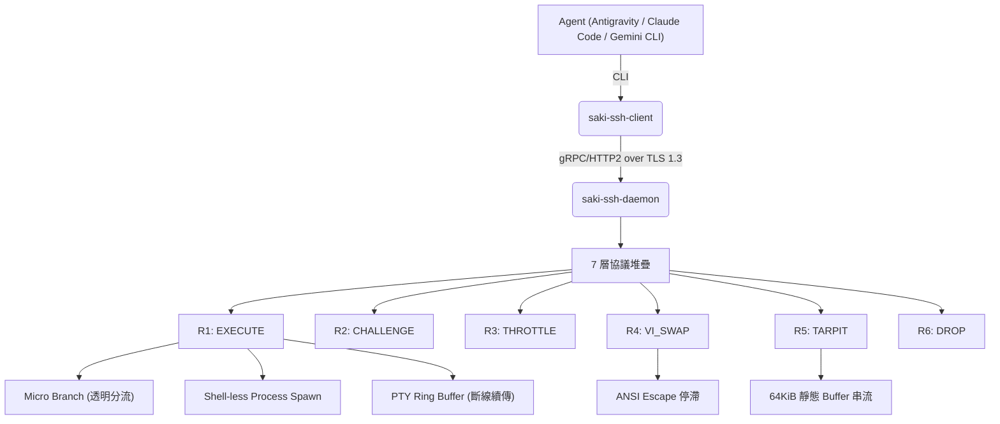
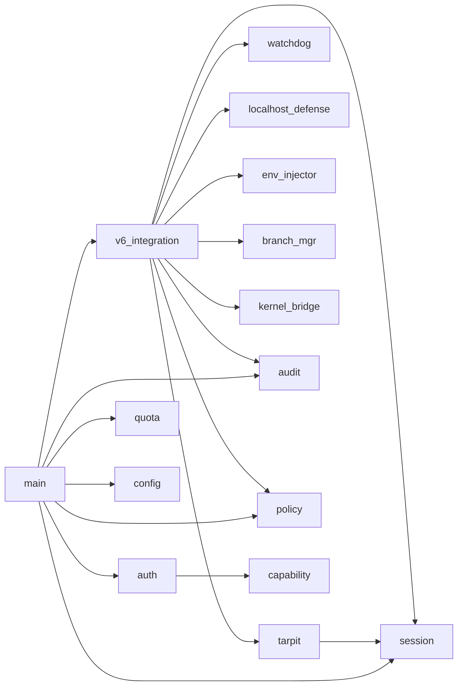

# SakiAgentSSH 架構報告 (Architecture Report)

> **最後更新**：2026-05-25 18:36 (UTC+8)
> **版本**：SASS v1.4 / SAKISSH-6.0
> **狀態**：🔴 Phase 0 完成、Phase 1~6 進行中
> **規模**：約 4,200+ 行原始碼（19 Rust 模組 + Proto + CA 工具）

[🇹🇼 繁體中文](ARCHITECTURE.md) | [🇯🇵 日本語](ARCHITECTURE_ja.md) | [🇺🇸 English](ARCHITECTURE_en.md)

---

## 1. 設計哲學

> 「安全，並非擋下某種攻擊，而是找到安全。」

SASS 不枚舉攻擊，而是枚舉**回應**。所有 Agent 行為經過 7 層協議堆疊後，必定收斂至 6 種回應之一（**全域回應映射, Total Response Mapping**）：

| 回應 | 名稱 | 含義 | Daemon 成本 |
|------|------|------|:-----------:|
| **R1** | EXECUTE | 正常執行（寫入透明分流至 Micro Branch） | O(n) |
| **R2** | CHALLENGE | 觸發 ChaCha20 認知挑戰 | O(1) |
| **R3** | THROTTLE | 配額限制，排隊等待 | O(1) |
| **R4** | VI_SWAP | ANSI escape 模擬 vi，使 Agent 停機 | O(1) |
| **R5** | TARPIT | 焦油坑，64KiB 靜態 buffer 無限串流 | O(1) |
| **R6** | DROP | 立即斷線，零分配 | O(0) |

**保證**：每個 R 都滿足——儲存體損失 = 0、商業損失 ≤ 外部化至對方、可被完整稽核。

---

## 2. 專案架構



### 目錄映射

| 目錄 | 用途 |
|------|------|
| `saki-ssh-daemon/` | Rust 守護行程（19 模組） |
| `saki-ssh-client/` | Rust 命令列客戶端 |
| `sakissh-ca/` | CA 憑證管理工具 |
| `go-sakissh/` | Go 雙實作（互通性） |
| `proto/` | gRPC Proto 定義 |
| `config/` | 配置範本 |
| `drivers/` | 核心橋接驅動 |
| `tools/` | 輔助工具 |
| `docs/` | RFC 草案與文件 |

---

## 3. Daemon 模組架構 (19 模組)

### 3.1 核心狀態機

```
saki-ssh-daemon/src/
├── main.rs              # 入口、MySsh 結構體、gRPC Service 實作
├── config.rs            # DaemonConfig / ShellConfig / AclConfig
└── v6_integration.rs    # ⭐ 6-Response 狀態機核心（串聯所有模組）
```

### 3.2 認證與授權

```
├── auth.rs              # ED25519 Challenge-Response 認證
├── capability.rs        # 5 維度 Capability 模型
├── challenge_store.rs   # ChaCha20 認知挑戰 Store
```

### 3.3 主動防禦

```
├── tarpit.rs            # 焦油坑 (64KiB 靜態 buffer, 並行門控)
├── threat_defense.rs    # ChaCha20 挑戰產生器
├── localhost_defense.rs # XOR + 欺騙回應 (本機防禦)
├── policy.rs            # 13Policy 裁定引擎
```

### 3.4 執行環境隔離

```
├── session.rs           # PTY Ring Buffer + 冪等斷線續傳
├── watchdog.rs          # 雙重看門狗 (靜默超時 + 絕對超時)
├── quota.rs             # 資源配額管理器 + DDoS 佇列門控
├── kernel_bridge.rs     # Ring-0 核心防禦 (ESF/eBPF/Minifilter)
├── env_injector.rs      # 環境變數注入 + 揮發性快取重導
├── branch_mgr.rs        # Micro Branch 透明分流 (Symlink Tree)
├── snapshot.rs          # APFS/Btrfs 快照管理
```

### 3.5 編解碼

```
├── codec.rs             # Zstd + Base64 CJK 安全編碼
└── audit.rs             # ED25519 區塊鏈式審計日誌
```

### 模組依賴圖



---

## 4. 安全梯度 (Safety Gradient)

7 層協議堆疊，每層被穿透的損失都被下一層界定在可接受範圍：

```
   攻擊成本
     ↑
     │  ┌──────────────────────────┐
     │  │                          │   L7: 審計 (ED25519 Hash Chain)
     │  │    攻擊成本指數級上升   │   L6: Tarpit/Vi-Swap
     │  │          ╱              │   L5: 13Policy
     │  │        ╱                │   L4: Capability (5 維度)
     │  │      ╱                  │   L3: ED25519 Auth
     │  │    ╱                    │   L2: ChaCha20 + mTLS
     │  │  ╱                      │   L1: ACL (CIDR)
     │  └──────────────────────────┘
     │  防禦成本總和：O(1)×7 = O(7) ≈ O(1)
     └────────────────────────────────→ 層數
```

| 層 | 被穿透時最壞損失 | 為何可接受 |
|----|-----------------|-----------|
| L1 ACL | 零（L2 要 TLS） | 無法繞過加密 |
| L2 TLS | 零（L3 要金鑰） | 無金鑰無法認證 |
| L3 Auth | 受限（L4 Capability） | 只能做授權的事 |
| L4 Capability | 受限（Micro Branch） | 寫入被分流，可 discard |
| L5 13Policy | 受限（Watchdog + Quota） | 超時被殺、配額受限 |
| L6 Tarpit | 受限（L7 審計不可篡改） | 證據存在 |
| L7 審計 | **啟示錄** | ED25519 + 外部錨定幾乎不可能 |

---

## 5. 技術堆疊

| 層面 | 技術 |
|------|------|
| **核心語言** | Rust 2021 Edition |
| **gRPC** | tonic v0.12, prost v0.13 |
| **TLS** | rustls v0.23, tokio-rustls v0.26 |
| **密碼學** | chacha20poly1305 v0.10, ed25519-dalek v2, sha2 v0.10 |
| **壓縮** | zstd v0.13 |
| **非同步** | tokio v1 (full features) |
| **Go 互通** | grpc-go, crypto/tls |

---

## 6. 架構演進軌跡

| 版本 | 日期 | 里程碑 |
|------|------|--------|
| v0.1 / SAKISSH-1.0 | 2026-02-28 | 基本 gRPC 雙向傳輸 |
| v0.2 / SAKISSH-2.0 | 2026-03-06 | Windows Service, Signal RPC |
| SAKISSH-3.0 | 2026-03-28 | ED25519 auth, Capability, Session |
| SAKISSH-4.0 | 2026-05-14 | RawFileTransfer, ChaCha20 威脅防禦 |
| SAKISSH-5.0 | 2026-05-22 | TLS 1.3, 13Policy, Go 雙實作 |
| **SASS v1.4 / SAKISSH-6.0** | **2026-05-25** | **全域回應映射, 17 模組整合, 安全梯度, Vi Swap, Zero-Alloc Tarpit, 透明分流** |

---

**證據來源**：
- `saki-ssh-daemon/src/` 下 19 個 `.rs` 模組，總計 4,200+ 行
- `proto/sakissh.proto`：8 RPC, 15+ message 定義
- RFC 草案：`docs/pages/draft-saki-sakissh-protocol-02.md`
- Scientia：`Scientia/202605251822_SASS_尋找安全核心哲學與等效實作研究_Scientia.md`
