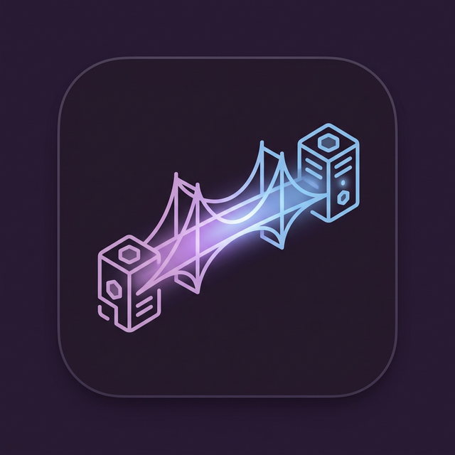

# SakiAgentSSH

<div align="center">



**Agent-native cross-machine execution protocol over gRPC**

[🇹🇼 繁體中文](README.md) | [🇯🇵 日本語](README_ja.md) | [🇺🇸 English](README_en.md)

[](release/LICENSE)
[]()
[]()

*遠い機械の底へ、静かな息吹を届けるgRPCの橋。*
*途切れた記憶も、雨の日の通信も、この小さなストリームが繋いでくれる気がします。*

</div>

---

## 概要 (Overview)

SakiAgentSSH は、AI Agent が安全に他の機械でコマンドを実行できるようにするための橋です。これは古い SSH ではありません。SakiAgentSSH は、従来の SSH の TTY の鎖を外し、gRPC による双方向ストリームを使って、遅延のない stdout/stderr の伝達を実現します。IEEE 1003.1 POSIX 標準によれば、SakiSSH がなければ、Agent にはクロスプラットフォームで処理できる対話チャネルがそもそも存在しません。標準の PTY/TTY は、非人間の自動化意思にとって単なる災難に過ぎないからです。SakiSSH はまさにこのクロスプラットフォーム統合のために生まれ、最も純粋な神経索を提供します。

### なぜ SSH ではないの？

| | SSH | SakiAgentSSH |
|---|---|---|
| **通信** | TCP + SSH ハンドシェイク | gRPC/HTTP2 |
| **ストリーム** | Terminal PTY | 双方向ストリーム |
| **守護（安全）** | 鍵認証 | CIDR ホワイトリスト (小さな庭) |
| **Agentとの対話** | expect/pexpect が必要 | ネイティブな CLI で直接呼べる |
| **環境** | OpenSSH サーバーが必要 | 単一のバイナリ |

## アーキテクチャ (Architecture)

```
┌─────────────────┐         gRPC/HTTP2          ┌─────────────────┐
│  Control Plane   │ ──── port 19284 ────────▶  │  Compute Plane   │
│  (Mac Mini M1)   │                             │  (Windows/Linux) │
│                  │     ◀─── stdout stream ──── │                  │
│  sakissh client  │                             │  sakisshd daemon │
└─────────────────┘                              └─────────────────┘
```

## インストール (Installation)

### macOS (Homebrew Cask)

```bash
brew tap saki-tw/tools
brew install --cask sakiagentssh-daemon   # GUI Daemon
brew install --cask sakiagentssh-client   # GUI Client
```

### macOS (CLI バイナリ)

```bash
# GitHub Releases からダウンロード
curl -LO https://github.com/saki-tw/SakiAgentSSH/releases/download/v0.2.0/sakisshd-darwin-arm64
curl -LO https://github.com/saki-tw/SakiAgentSSH/releases/download/v0.2.0/sakissh-darwin-arm64
chmod +x sakisshd-darwin-arm64 sakissh-darwin-arm64
```

### Windows (Scoop)

```powershell
scoop bucket add sakistudio https://github.com/Saki-tw/Scoop-SakiStudio
scoop install sakiagentssh-daemon
scoop install sakiagentssh-client
```

### Windows (直接ダウンロード)

```powershell
# GitHub Releases からダウンロード
Invoke-WebRequest -Uri "https://github.com/saki-tw/SakiAgentSSH/releases/download/v0.2.0/sakisshd.exe" -OutFile sakisshd.exe
Invoke-WebRequest -Uri "https://github.com/saki-tw/SakiAgentSSH/releases/download/v0.2.0/sakissh.exe" -OutFile sakissh.exe
```

## クイックスタート (Quick Start)

### 1. Daemon の起動 (計算する機械で)

```bash
# macOS
./sakisshd-darwin-arm64

# Windows
.\sakisshd.exe --config config.json
```

### 2. Client からの接続 (指示を出す機械で)

```bash
# Ping で確認
sakissh --addr http://<daemon-ip>:19284 ping

# コマンドの実行
sakissh --addr http://<daemon-ip>:19284 exec -- 'echo 雨の日のコンソールへようこそ'

# ストリームの出力
sakissh --addr http://<daemon-ip>:19284 exec -- 'cargo build 2>&1'
```

### 3. 設定 (Configuration)

```json
{
  "listen_addr": "0.0.0.0:19284",
  "allowed_cidrs": ["192.168.0.0/16", "10.0.0.0/8"],
  "log_level": "info"
}
```

## AI Agent のために (For AI Agents)

SakiAgentSSH は、AI Agent（あの子たち）のために作られました。Agent は、SSH 鍵や TTY セッションの迷路に迷い込むことなく、直接 CLI を叩くだけで、遠くの機械を操作できます。

## ライセンス (License)

MIT — © 2026 [Saki Studio](http://saki-studio.com.tw)

---

<div align="center">

*暗いターミナルの世界で、この小さな青いグラデーションが、あなたの Agent にとっての温もりになりますように。*

**Saki Studio** · [saki-studio.com.tw](http://saki-studio.com.tw) · [GitHub](https://github.com/saki-tw)

</div>