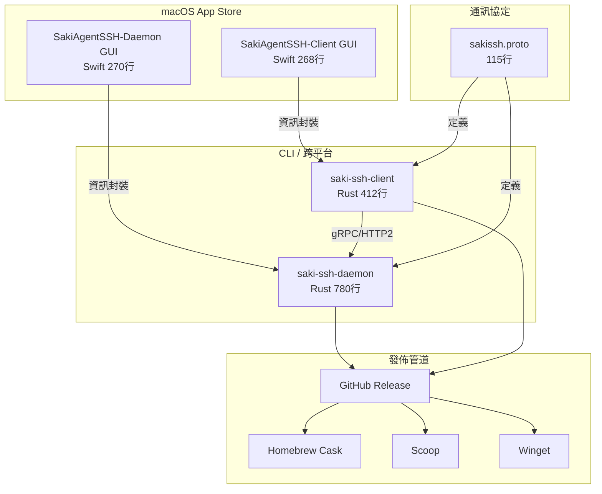

# SakiAgentSSH 架構現況報告 (Architecture Status Report)

> **建立時間**：2026-03-03 02:41 (UTC+8)
> **版本**：2.0（差分對照 v1.0 ARCHITECTURE.md）
> **規模**：微型 (約 1,880 行原始碼)
> **前版報告**：`ARCHITECTURE.md` v1.0 (2026-02-28)

---

## 1. 專案目前架構 (Current Architecture)

### 目錄映射

| 目錄 | 角色 | 檔案數 | 行數 |
|------|------|--------|------|
| `saki-ssh-daemon/src/` | Rust gRPC 守護進程 | 3 (main.rs, config.rs, build.rs) | ~780 |
| `saki-ssh-client/src/` | Rust gRPC 命令列客戶端 | 2 (main.rs, build.rs) | ~412 |
| `SakiAgentSSH-Daemon/Sources/` | Swift macOS GUI (About + Help) | 1 | 270 |
| `SakiAgentSSH-Client/Sources/` | Swift macOS GUI | 1 | 268 |
| `proto/` | gRPC 協定定義 | 1 | 115 |
| `release/` | 發佈資源（Homebrew/Scoop/Winget/圖示/文案） | 26 | N/A |
| `tools/async-ssh/` | 輔助工具 | 1 | ~150 |
| `docs/` | 專案文檔 | 4 | N/A |

---

## 2. 技術實作堆疊

| 維度 | Rust CLI | Swift GUI |
|------|----------|-----------|
| 語言 | Rust 2021 Edition | Swift 5.9 / SwiftUI |
| 網路通訊 | tonic v0.12 + prost v0.13 | 無（純資訊 UI） |
| 非同步 | tokio v1.0 | SwiftUI 原生 |
| CLI 解析 | clap v4.4 | N/A |
| ACL | ipnet crate | N/A |
| 建置系統 | Cargo | Xcode (project.yml → XcodeGen) |
| 部署目標 | macOS 13.0+ / Windows | macOS 13.0+ (App Store) |

---

## 3. 差距分析（對照 ARCHITECTURE.md v1.0）

### 穩定模組（無變化）

| 模組 | v1.0 狀態 | v2.0 狀態 | 判定 |
|------|-----------|-----------|------|
| gRPC proto 定義 | 7 RPC, 12 message | 相同 | ✅ 穩定 |
| Rust daemon 核心 | TrackedProcess + ACL | 相同 | ✅ 穩定 |
| Rust client | Execute/Cancel/File | 相同 | ✅ 穩定 |

### 新增模組（v1.0 未記錄）

| 模組 | 描述 | 狀態 |
|------|------|------|
| Swift Daemon GUI | macOS App Store 封裝（About + HelpView） | 🔶 已實作但 entitlement 被審核質疑 |
| Swift Client GUI | macOS App Store 封裝 | 🔶 待確認審核狀態 |
| Homebrew Cask | `sakiagentssh-daemon.rb` + `sakiagentssh-client.rb` | ✅ 配置完成 |
| Scoop | `sakiagentssh-daemon.json` + `sakiagentssh-client.json` | ✅ 配置完成 |
| Winget | 8 個 YAML manifest | ✅ 配置完成 |
| 多語系 Help | zh-Hant / en-US / ja-JP | ✅ 已實作 |
| App Store 文案 | description_long/short + subtitle + tags | ✅ 已準備 |
| REVIEW_GUIDE | Client + Daemon 審核指南 | ✅ 已準備 |
| config.rs | Daemon 配置管理模組 | ✅ 已實作（v1.0 未獨立記錄） |

---

## 4. 已知問題

### 🔴 App Store Review 問題
- **Guideline 2.4.5(i)**：Daemon GUI 宣告了 `com.apple.security.network.server` entitlement
- **問題本質**：GUI 是純資訊型（About + Help），不執行任何 gRPC 服務
- **建議**：移除 `network.server` entitlement 後重新提交

### 🟡 殘留目錄
- `/Users/hc1034/Saki_Studio/Claude/SakiSSH/`：獨立路徑殘留，僅含 `saki-ssh-daemon/`，疑為早期獨立專案
- `/Users/hc1034/Saki_Studio/Claude/SakiAgentSSH/SakiSSH/`：空目錄，僅含 `.gitignore`

### 🟡 git 同步
- `origin/main` 落後本地 `main` 6 個 commits（最後 push 停在 `feat: v0.2.0 initial release`）
- 後續 6 個 commits 皆為 App Store 上架修復（icon、archive、build number、quarantine xattr）

---

## 5. 版本一致性驗證

| 元件 | 版本 | 來源 |
|------|------|------|
| Rust daemon (Cargo.toml) | 0.2.0 | ✅ |
| Rust client (Cargo.toml) | 0.2.0 | ✅ |
| Swift Daemon (project.yml) | 0.2.0 Build 6 | ✅ |
| Swift Client (project.yml) | 0.2.0 | ✅ |
| proto/sakissh.proto | — | ✅ 一致（與 release/ 相同） |

---

## 6. 程式碼統計

| 元件 | 行數 | 測試數 | 前版行數 | 差額 |
|------|------|--------|---------|------|
| saki-ssh-daemon (Rust) | ~780 | 0 | ~780 (v1.0) | ±0 |
| saki-ssh-client (Rust) | ~412 | 0 | ~412 (v1.0) | ±0 |
| SakiAgentSSH-Daemon (Swift) | 270 | 0 | N/A (新增) | +270 |
| SakiAgentSSH-Client (Swift) | 268 | 0 | N/A (新增) | +268 |
| proto | 115 | — | 115 | ±0 |
| tools/async-ssh | ~150 | 0 | ~150 | ±0 |
| **總計** | **~1,995** | **0** | **~1,457** | **+538** |

> **⚠️ 品質風險**：整體測試數為 0。建議優先建立 Rust 端的核心整合測試（ACL 驗證、proto 序列化/反序列化）。
