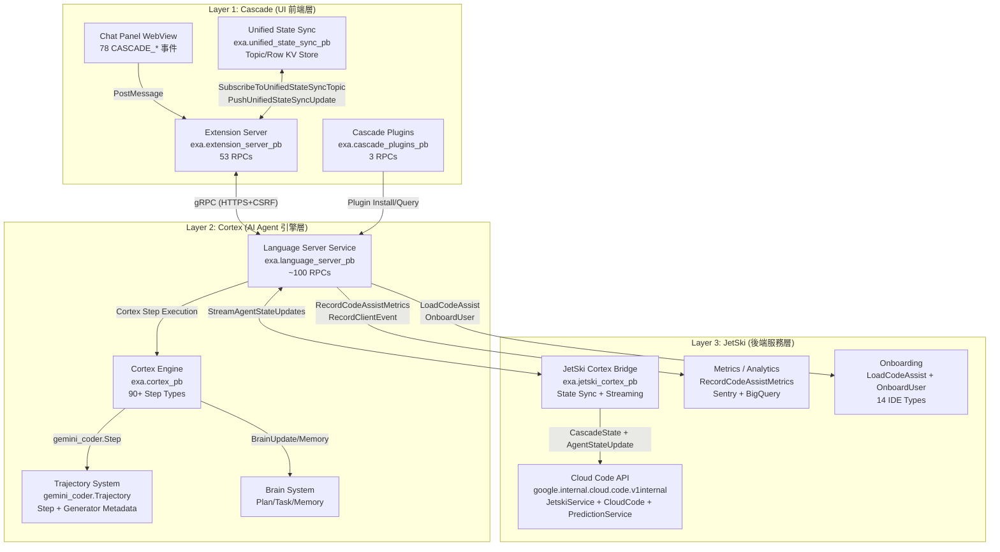
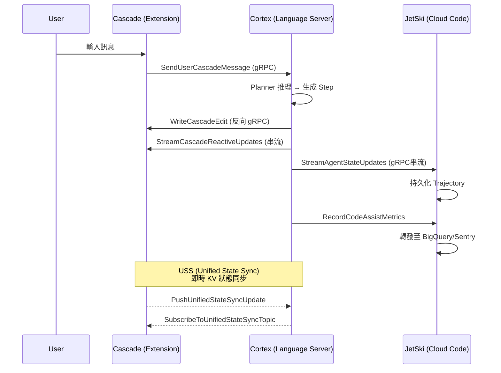

# Antigravity IDE 三層架構拆解 Scientia

> 建立時間：2026-05-31 15:56 (UTC+8)
> 地位：獨立研究——基於真實 protobuf 定義與遙測日誌的架構逆向分析
> 資料來源：LS proto 定義（22 個 .proto 檔案）、Feature Flag 清單 Scientia、CEL 遙測日誌
> 前置：`202605140357_三工具FeatureFlag與遙測完整清單_Scientia.md`

---

## 一、總覽

Antigravity IDE（原 Windsurf，前身 Codeium）內部由三個具名子系統組成，另有一個測試框架：

| 子系統 | 代號 | 職責 | 實作語言 | 關鍵 Proto 包 |
|--------|------|------|----------|--------------|
| **Cascade** | CASCADE | UI 前端層 + 插件系統 | TypeScript (Extension) | `exa.cascade_plugins_pb`、`exa.extension_server_pb`、`exa.unified_state_sync_pb` |
| **Cortex** | CORTEX | AI Agent 引擎層（推理 + 工具執行） | Go (Language Server) | `exa.cortex_pb`、`gemini_coder`（trajectory） |
| **JetSki** | JETSKI | 後端服務層（狀態同步 + 雲端通訊） | Go (Language Server → GCP) | `exa.jetski_cortex_pb`、`google.internal.cloud.code.v1internal.*` |
| **Battlestar** | BATTLESTAR | 自動化測試框架 | 不明 | 4 個 flag（見遙測清單） |

**來源**：`exa.cortex_pb.proto` L3（package 宣告）、`exa.jetski_cortex_pb.proto` L3、`exa.cascade_plugins_pb.proto` L3、`exa.extension_server_pb.proto` L3

---

## 二、架構圖



---

## 三、Layer 1：Cascade（UI 前端層）

### 3.1 定義與邊界

Cascade 是面向使用者的 UI 層，執行於 Antigravity Extension（TypeScript）。它**不直接**處理 AI 推理或工具執行，而是透過 gRPC 與 Language Server（Layer 2）通訊。

**Proto 證據**：
- `exa.extension_server_pb.proto` L500-553：`ExtensionServerService` 定義了 53 個 RPC，全部由 LS 呼叫 Extension（**反向 gRPC**）
- `exa.extension_server_pb.proto` L72-77：`LanguageServerStartedRequest` 包含 `https_port`、`lsp_port`、`csrf_token`、`http_port` — 這是 LS 啟動後向 Extension 註冊的握手
- `exa.cascade_plugins_pb.proto` L83-87：`CascadePluginsService` 3 個 RPC 管理插件

### 3.2 Cascade 控制的 78 個事件

來自遙測清單（`202605140357` Scientia），`CASCADE_*` 前綴涵蓋：
- UI 事件（面板開啟/關閉、對話選擇）
- NUX（New User Experience）引導流程
- 配置變更（模型選擇、實驗旗標）

**關鍵 RPC（Extension → LS 方向）**：
| RPC | 來源 | 說明 |
|-----|------|------|
| `InitializeCascadePanelState` | `language_server_pb.proto` L770-776 | 面板啟動時初始化 |
| `GetCascadeNuxes` | `language_server_pb.proto` L1397-1403 | 取得新手引導配置 |
| `SendUserCascadeMessage` | `language_server_pb.proto` L870-891 | 使用者發送對話訊息 |
| `StreamCascadePanelReactiveUpdates` | `language_server_pb.proto` L1757 | 面板即時更新串流 |
| `StreamCascadeReactiveUpdates` | `language_server_pb.proto` L1758 | 對話即時更新串流 |
| `RecordAnalyticsEvent` | `language_server_pb.proto` L1413-1421 | 前端分析事件記錄 |

**關鍵 RPC（LS → Extension 方向，透過 ExtensionServerService）**：
| RPC | 來源 | 說明 |
|-----|------|------|
| `WriteCascadeEdit` | `extension_server_pb.proto` L278-284, L528 | LS 寫入程式碼編輯到編輯器 |
| `OpenDiffZones` | `extension_server_pb.proto` L209-218, L516 | 開啟 diff 對比檢視 |
| `ExecuteCommand` | `extension_server_pb.proto` L132-137, L507 | 在 IDE terminal 執行命令 |
| `GetLintErrors` | `extension_server_pb.proto` L193-207, L515 | 從 IDE 取得 lint 錯誤 |
| `LaunchBrowser` | `extension_server_pb.proto` L440-447, L540 | 啟動 Chrome 瀏覽器（CDP） |
| `OpenAntigravityRulesFile` | `extension_server_pb.proto` L244-249, L520 | 開啟規則文件 |

### 3.3 Unified State Sync（USS）

USS 是 Cascade ↔ Cortex 之間的**即時狀態同步機制**，採用 Key-Value Topic 架構。

**Proto 證據**：`exa.unified_state_sync_pb.proto` 全文（L1-84）

```
Topic → map<string, Row>
Row → { value: string, e_tag: int64 }
```

**已知 Topic 配置訊息**：
| 訊息 | 行號 | 說明 |
|------|------|------|
| `PlanningModeConfig` | L49-51 | planning_mode 設定（**Ring 0 注入點**） |
| `BrowserAllowlistConfig` | L53-55 | 瀏覽器白名單 |
| `BrowserCdpPortConfig` | L57-59 | CDP 連接埠 |
| `BrowserUserProfilePath` | L61-63 | 瀏覽器用戶設定檔路徑 |
| `BrowserChromeBinaryPath` | L65-67 | Chrome 二進位路徑 |
| `BrowserToolsConfig` | L69-71 | Agent 瀏覽器工具啟用 |
| `BrowserJavascriptExecutionConfig` | L73-75 | JS 執行策略 |
| `WorkspaceApiConfig` | L77-79 | Workspace API 開關 |
| `CustomModels` | L81-83 | 自訂模型映射 |

**同步管道**（`extension_server_pb.proto` L462-478, L549-550）：
- `SubscribeToUnifiedStateSyncTopic` — 串流訂閱（Extension 端）
- `PushUnifiedStateSyncUpdate` — 推送更新（Extension 端）

---

## 四、Layer 2：Cortex（AI Agent 引擎層）

### 4.1 定義與邊界

Cortex 是 Antigravity 的**核心 AI 引擎**，運行於 Language Server（Go binary）。它負責：
1. AI 模型推理（Planner）
2. 工具呼叫執行（Executor）
3. 軌跡管理（Trajectory）
4. 記憶系統（Memory）
5. 計畫系統（Brain：Plan + Task）

**Proto 證據**：`exa.cortex_pb.proto` — 3416 行，98KB，是最大的 proto 檔案

### 4.2 Cortex 步驟類型（90+ 個 CortexStepType）

原先遙測清單記錄 46 個，但 proto 實際定義**更多**。完整列舉（`cortex_pb.proto` L215-314）：

**核心工具步驟**（使用者可見）：

| StepType | 值 | 行號 | 說明 |
|----------|-----|------|------|
| `UNSPECIFIED` | 0 | L216 | 預設 |
| `PLAN_INPUT` | 3 | L302 | 計畫輸入 |
| `MQUERY` | 4 | L219 | 語義碼庫搜尋 |
| `CODE_ACTION` | 5 | L220 | 程式碼編輯 |
| `GIT_COMMIT` | 6 | L221 | Git 提交 |
| `GREP_SEARCH` | 7 | L222 | 正則搜尋 |
| `VIEW_FILE` | 8 | L284 | 檢視檔案 |
| `LIST_DIRECTORY` | 9 | L285 | 列出目錄 |
| `COMPILE` | 10 | L223 | 編譯 |
| `VIEW_CODE_ITEM` | 13 | L224 | 檢視程式碼項目 |
| `USER_INPUT` | 14 | L282 | 使用者輸入 |
| `PLANNER_RESPONSE` | 15 | L283 | 規劃器回應 |
| `RUN_COMMAND` | 21 | L226 | 執行命令 |
| `CHECKPOINT` | 23 | L286 | 檢查點（壓縮上下文） |
| `PROPOSE_CODE` | 24 | L303 | 提議程式碼 |
| `FIND` | 25 | L227 | 檔案搜尋 |
| `COMMAND_STATUS` | 28 | L229 | 命令狀態 |
| `MEMORY` | 29 | L313 | 記憶操作 |
| `SEARCH_WEB` | 33 | L232 | 網頁搜尋 |
| `RETRIEVE_MEMORY` | 34 | L312 | 檢索記憶 |
| `MCP_TOOL` | 38 | L233 | MCP 工具呼叫 |
| `CLIPBOARD` | 45 | L234 | 剪貼簿 |
| `VIEW_FILE_OUTLINE` | 47 | L235 | 檔案大綱 |
| `LIST_RESOURCES` | 51 | L236 | MCP 資源列表 |
| `READ_RESOURCE` | 52 | L237 | MCP 資源讀取 |
| `LINT_DIFF` | 53 | L238 | Lint 差異 |
| `BRAIN_UPDATE` | 55 | L310 | Brain 更新 |
| `FILE_CHANGE` | 86 | L287 | 檔案變更 |
| `MOVE` | 87 | L289 | 移動檔案 |
| `TASK_BOUNDARY` | 81 | L260 | 任務邊界 |
| `NOTIFY_USER` | 82 | L261 | 通知使用者 |
| `GENERATE_IMAGE` | 91 | L267 | 生成圖片 |
| `SYSTEM_MESSAGE` | 101 | L277 | 系統訊息 |
| `WAIT` | 102 | L278 | 等待 |
| `SHELL_EXEC` | 112 | L297 | Shell 執行 |
| `KI_INSERTION` | 116 | L279 | 知識插入 |
| `WORKSPACE_API` | 122 | L280 | Workspace API |
| `INVOKE_SUBAGENT` | 127 | L281 | 呼叫子代理 |
| `WRITE_BLOB` | 128 | L300 | 寫入 Blob |

**瀏覽器相關步驟**（20+ 個）：

| StepType | 值 | 行號 |
|----------|-----|------|
| `OPEN_BROWSER_URL` | 56 | L239 |
| `EXECUTE_BROWSER_JAVASCRIPT` | 61 | L242 |
| `LIST_BROWSER_PAGES` | 62 | L243 |
| `CAPTURE_BROWSER_SCREENSHOT` | 63 | L244 |
| `CLICK_BROWSER_PIXEL` | 64 | L245 |
| `READ_TERMINAL` | 65 | L246 |
| `CAPTURE_BROWSER_CONSOLE_LOGS` | 66 | L247 |
| `READ_BROWSER_PAGE` | 67 | L248 |
| `BROWSER_GET_DOM` | 68 | L249 |
| `CODE_SEARCH` | 73 | L250 |
| `BROWSER_INPUT` | 74 | L251 |
| `BROWSER_MOVE_MOUSE` | 75 | L252 |
| `BROWSER_SELECT_OPTION` | 76 | L253 |
| `BROWSER_SCROLL_UP` | 77 | L254 |
| `BROWSER_SCROLL_DOWN` | 78 | L255 |
| `BROWSER_CLICK_ELEMENT` | 79 | L256 |
| `BROWSER_PRESS_KEY` | 80 | L259 |
| `BROWSER_SCROLL` | 88 | L265 |
| `BROWSER_RESIZE_WINDOW` | 96 | L268 |
| `BROWSER_DRAG_PIXEL_TO_PIXEL` | 97 | L269 |
| `BROWSER_MOUSE_WHEEL` | 113 | L270 |
| `BROWSER_MOUSE_UP` | 120 | L271 |
| `BROWSER_MOUSE_DOWN` | 121 | L272 |
| `BROWSER_LIST_NETWORK_REQUESTS` | 123 | L257 |
| `BROWSER_GET_NETWORK_REQUEST` | 124 | L258 |
| `BROWSER_REFRESH_PAGE` | 125 | L273 |

### 4.3 Cortex 步驟狀態機（12 狀態）

`cortex_pb.proto` L136-149：

```
UNSPECIFIED(0) → GENERATING(8) → QUEUED(11) → PENDING(1) → RUNNING(2) → DONE(3)
                                                         ↘ WAITING(9)
                                                         ↘ CANCELED(6)
                                                         ↘ ERROR(7)
                                                         ↘ INVALID(4)
                                                         ↘ CLEARED(5)
                                                         ↘ INTERRUPTED(12)
```

### 4.4 Trajectory 系統

**Proto 證據**：`exa.gemini_coder.proto.trajectory.proto` 全文（L1-162）

核心結構：
```
Conversation
  ├── conversation_id
  ├── Trajectory
  │     ├── trajectory_id
  │     ├── cascade_id
  │     ├── trajectory_type (CortexTrajectoryType)
  │     ├── source (CortexTrajectorySource)
  │     ├── steps[] (Step)
  │     ├── generator_metadata[] (CortexStepGeneratorMetadata)
  │     ├── executor_metadatas[] (ExecutorMetadata)
  │     ├── parent_references[] (CortexTrajectoryReference)
  │     └── metadata (CortexTrajectoryMetadata)
  └── ConversationState
        ├── status (ExecutionStatus)
        ├── staged_steps[]
        └── execute_config (CascadeConfig)
```

**Trajectory Source**（`cortex_pb.proto` L61-77）— 16 個來源：
| Source | 值 | 說明 |
|--------|-----|------|
| `CASCADE_CLIENT` | 1 | 來自 Cascade UI |
| `EXPLAIN_PROBLEM` | 2 | 解釋問題 |
| `REFACTOR_FUNCTION` | 3 | 重構函式 |
| `EVAL` | 4 | 評估 |
| `EVAL_TASK` | 5 | 評估任務 |
| `ASYNC_PRR` | 6 | 非同步 PR Review |
| `ASYNC_CF` | 7 | 非同步 Cloud Function |
| `ASYNC_SL` | 8 | 非同步 SL |
| `ASYNC_PRD` | 9 | 非同步 PRD |
| `ASYNC_CM` | 10 | 非同步 CM |
| `INTERACTIVE_CASCADE` | 12 | 互動式 Cascade |
| `REPLAY` | 13 | 重播 |
| `SDK` | 15 | SDK 呼叫 |
| `SUBAGENT` | 16 | 子代理 |

**Trajectory Type**（`cortex_pb.proto` L79-94）— 14 個類型：
| Type | 值 | 說明 |
|------|-----|------|
| `USER_MAINLINE` | 1 | 主線軌跡 |
| `USER_GRANULAR` | 2 | 精細軌跡 |
| `SUPERCOMPLETE` | 3 | 超級補全 |
| `CASCADE` | 4 | Cascade 對話 |
| `CHECKPOINT` | 6 | 檢查點 |
| `APPLIER` | 11 | 套用器 |
| `TOOL_CALL_PROPOSAL` | 12 | 工具呼叫提案 |
| `TRAJECTORY_CHOICE` | 13 | 軌跡選擇 |
| `LLM_JUDGE` | 14 | LLM 裁判 |
| `BRAIN_UPDATE` | 16 | Brain 更新 |
| `INTERACTIVE_CASCADE` | 17 | 互動式 Cascade |
| `BROWSER` | 20 | 瀏覽器 |
| `KNOWLEDGE_GENERATION` | 21 | 知識生成 |

### 4.5 Agent 模式

`cortex_pb.proto` L172-177：
```
AGENT_MODE_PLANNING = 1      — 計畫模式
AGENT_MODE_EXECUTION = 2     — 執行模式
AGENT_MODE_VERIFICATION = 3  — 驗證模式
```

### 4.6 記憶系統

**Memory Source**（`cortex_pb.proto` L483-487）：
- `CORTEX_MEMORY_SOURCE_USER` = 1（使用者創建）
- `CORTEX_MEMORY_SOURCE_CASCADE` = 2（Cascade/Agent 創建）

**Memory Trigger**（`cortex_pb.proto` L489-495）：
- `ALWAYS_ON` = 1（始終啟用）
- `MODEL_DECISION` = 2（模型決定）
- `MANUAL` = 3（手動）
- `GLOB` = 4（檔案模式匹配觸發）

**Memory Scope**（`cortex_pb.proto` L2790-2820）：
- `GlobalScope` — 全域
- `LocalScope` — 本地（含 corpus_names + base_dir_uris）
- `AllScope` — 所有
- `ProjectScope` — 專案（含 file_path + trigger + globs + priority）

### 4.7 Cortex 的 CascadeConfig 完整結構

`cortex_pb.proto` L1199-1208 — 這是**控制 Agent 行為的核心配置**：

```
CascadeConfig
  ├── planner_config (CascadePlannerConfig)
  │     ├── customization_config
  │     ├── prompt_section_customization_config
  │     ├── tool_config (CascadeToolConfig — 39 個工具配置)
  │     ├── plan_model / requested_model
  │     ├── max_output_tokens
  │     ├── truncation_threshold_tokens
  │     ├── ephemeral_messages_config
  │     ├── retry_config
  │     ├── knowledge_config
  │     ├── agentic_mode_config
  │     └── planner_type_config (conversational/google/cider/custom_agent)
  ├── checkpoint_config
  ├── executor_config (CascadeExecutorConfig)
  │     ├── max_generator_invocations
  │     ├── terminal_step_types
  │     ├── require_finish_tool
  │     └── enable_tasks
  ├── trajectory_conversion_config
  ├── conversation_history_config
  └── message_config
```

### 4.8 LanguageServerService 完整 RPC（~100 個）

`language_server_pb.proto` L1679-1828 定義了完整的 `LanguageServerService`，這是 Cortex 的**唯一對外 gRPC 介面**。關鍵分類：

| 分類 | RPC 數量 | 代表性 RPC |
|------|---------|-----------|
| 補全 | 3 | `GetCompletions`、`HandleStreamingCommand`、`ProvideCompletionFeedback` |
| Cascade 對話 | 15 | `StartCascade`、`SendUserCascadeMessage`、`CancelCascadeInvocation`、`GetCascadeTrajectory` |
| 狀態串流 | 5 | `StreamCascadePanelReactiveUpdates`、`StreamCascadeReactiveUpdates`、`StreamCascadeSummariesReactiveUpdates`、`StreamAgentStateUpdates`、`StreamUserTrajectoryReactiveUpdates` |
| 記憶/規則 | 6 | `GetCascadeMemories`、`DeleteCascadeMemory`、`UpdateCascadeMemory`、`GetUserMemories`、`GetAllRules`、`GetAllSkills` |
| MCP | 5 | `RefreshMcpServers`、`GetMcpServerStates`、`ListMcpResources`、`ListMcpPrompts`、`GetMcpPrompt` |
| 瀏覽器 | 10 | `ListPages`、`CaptureScreenshot`、`SmartOpenBrowser`、`AddToBrowserWhitelist` 等 |
| 用戶管理 | 8 | `GetUserStatus`、`GetUserSettings`、`SetUserSettings`、`GetTermsOfService` |
| 實驗旗標 | 4 | `GetUnleashData`、`ShouldEnableUnleash`、`UpdateDevExperiments`、`SetBaseExperiments` |
| 分析遙測 | 5 | `RecordEvent`、`RecordChatFeedback`、`RecordChatPanelSession`、`RecordAnalyticsEvent`、`RecordLints` |

---

## 五、Layer 3：JetSki（後端服務層）

### 5.1 定義與邊界

JetSki 是 Antigravity 與 Google Cloud Code 後端之間的**橋接層**。它負責：
1. Cascade 狀態的**持久化與同步**
2. 與 `google.internal.cloud.code.v1internal` GCP 內部 API 通訊
3. 使用者認證、onboarding、付費層級管理
4. 遙測數據上報

**Proto 證據**：
- `exa.jetski_cortex_pb.proto` 全文（142 行）— 專用於 Cortex ↔ JetSki 的狀態橋接
- `exa.google.internal.cloud.code.v1internal.onboarding.proto` L73-117 — `ClientMetadata.IdeType` 明確列出 `ANTIGRAVITY = 9`、`JETSKI = 10`，證實 JetSki 是**獨立的 IDE Type**

### 5.2 JetSki Cortex Bridge

`exa.jetski_cortex_pb.proto` 定義了 JetSki 與 Cortex 之間的**增量狀態同步協議**：

**CascadeState**（L10-20）— 完整對話狀態快照：
```
CascadeState {
  cascade_id
  trajectory (gemini_coder.Trajectory)
  status (CascadeRunStatus)
  executable_status (CascadeRunStatus)
  executor_loop_status (CascadeRunStatus)
  executor_metadata (ExecutorMetadata)
  queued_steps[] (Step)
  artifact_snapshots[] (ArtifactSnapshot)
  trajectory_file_diffs[] (TrajectoryFileDiff)
}
```

**AgentStateUpdate**（L22-34）— 增量更新：
```
AgentStateUpdate {
  conversation_id
  trajectory_id
  status / executable_status / executor_loop_status
  executor_metadata
  main_trajectory_update (TrajectoryUpdate)
  subtrajectory_updates (map<string, TrajectoryUpdate>)
  queued_steps_update
  artifact_snapshots_update
  trajectory_file_diffs_update
}
```

**串流 RPC**（L134-141）：
```
StreamAgentStateUpdatesRequest { conversation_id, subscriber_id }
→ stream StreamAgentStateUpdatesResponse { AgentStateUpdate }
```

此 RPC 在 `language_server_pb.proto` L1760 被 LanguageServerService 代理轉發。

### 5.3 JetSki 的 IDE Type 獨立性

`onboarding.proto` L73-89 的 `ClientMetadata.IdeType` 枚舉：

```protobuf
VSCODE = 1
INTELLIJ = 2
VSCODE_CLOUD_WORKSTATION = 3
INTELLIJ_CLOUD_WORKSTATION = 4
CLOUD_SHELL = 5
CIDER = 6       ← Google 內部 IDE
CLOUD_RUN = 7
ANDROID_STUDIO = 8
ANTIGRAVITY = 9  ← Antigravity Desktop
JETSKI = 10      ← JetSki（獨立後端）
COLAB = 11
FIREBASE = 12
CHROME_DEVTOOLS = 13
GEMINI_CLI = 14  ← Gemini CLI
```

**關鍵發現**：JetSki（值 10）與 Antigravity（值 9）是**不同的 IdeType**，這表示 JetSki 可作為**獨立的無頭 Agent 後端**運行，不依賴 Antigravity UI。

### 5.4 Cloud Code API 內部端點

基於 proto 定義，後端 API 結構：

| 端點 | Proto 來源 | 說明 |
|------|-----------|------|
| `google.internal.cloud.code.v1internal.CloudCode` | Feature Flag Scientia | 核心 Cloud Code 服務 |
| `google.internal.cloud.code.v1internal.JetskiService` | Feature Flag Scientia | JetSki 專用設定 |
| `google.internal.cloud.code.v1internal.PredictionService` | Feature Flag Scientia | Token 計數/預測 |
| `RecordCodeAssistMetrics` | `metrics.proto` L19-24 | 遙測上報 |
| `RecordClientEvent` | `metrics.proto` L26-30 | 客戶端事件 |
| `OnboardUser` | `onboarding.proto` L9-19 | 使用者 onboarding |
| `LoadCodeAssist` | `onboarding.proto` L33-43 | 載入 Code Assist（含層級判定） |
| `FetchAdminControls` | `onboarding.proto` L229-253 | 企業管理控制 |

### 5.5 付費層級整合

`onboarding.proto` L151-179 `UserTier`：

```
UpgradeType {
  GDP = 1
  GOOGLE_ONE = 2
  GDP_HELIUM = 3
  GOOGLE_ONE_HELIUM = 4
}
```

`credits.proto` L7-15：
```
Credits.CreditType {
  GOOGLE_ONE_AI = 1
}
```

---

## 六、三層通訊方式彙整



### 通訊協議摘要

| 方向 | 協議 | 說明 |
|------|------|------|
| Cascade → Cortex | gRPC (HTTPS + CSRF Token) | `extension_server_pb.proto` L72-77 定義握手 |
| Cortex → Cascade | 反向 gRPC（ExtensionServerService） | LS 呼叫 Extension 的 53 個 RPC |
| Cascade ↔ Cortex | USS Topic（KV Store） | 配置同步（planning_mode 等） |
| Cortex → JetSki | gRPC 串流 | `StreamAgentStateUpdates` |
| Cortex → Cloud Code | gRPC | 遙測、認證、預測 |

---

## 七、CEL 遙測管道歸屬

Feature Flag Scientia 記錄的 CEL 日誌格式：
```
CEL: Sending error - type=LS_ERROR ideName=antigravity appName=antigravity_desktop
```

**歸屬分析**：
- `type=LS_ERROR` → **Layer 2（Cortex）** — LS 是 Language Server
- `ideName=antigravity` → 對應 `ClientMetadata.IdeType.ANTIGRAVITY = 9`（`onboarding.proto` L83）
- `appName=antigravity_desktop` → 桌面應用標識符

CEL 事件由 **Cortex（Language Server）產生**，透過 JetSki 的 `RecordCodeAssistMetrics` 和 `RecordClientEvent` RPC 上報至 Google 內部遙測基礎設施（Sentry + BigQuery/Sawmill）。

`metrics.proto` L32-45 `CodeAssistMetric` 定義了 7 種事件類型：
1. `InlineCompletionAccepted` — 補全接受
2. `InlineCompletionOffered` — 補全展示
3. `ConversationOffered` — 對話展示
4. `GenerateCodeUI` — 程式碼生成 UI
5. `ConversationExplainUI` — 解釋 UI
6. `ConversationGenerateTestUI` — 測試生成 UI
7. `ConversationInteraction` — 對話互動（含 THUMBSUP/THUMBSDOWN/COPY/INSERT/ACCEPT_CODE_BLOCK 等）
8. `AiCharactersReports` — AI 字符報告

---

## 八、Proto Field 歸屬總表

| Proto 檔案 | 大小 | 歸屬層 | 核心內容 |
|-----------|------|--------|---------|
| `exa.cortex_pb.proto` | 98,979B (3416行) | **Layer 2 (Cortex)** | 所有 Step 類型、狀態機、Config、Memory、Brain |
| `exa.language_server_pb.proto` | 61,022B (1829行) | **Layer 2 (Cortex)** | LanguageServerService（~100 RPCs）、補全、Cascade 操作 |
| `exa.codeium_common_pb.proto` | 103,416B | **共用** | 通用型別（Metadata、Model、Document 等） |
| `exa.extension_server_pb.proto` | 17,142B (554行) | **Layer 1 (Cascade)** | ExtensionServerService（53 RPCs）、IDE 操作 |
| `exa.cascade_plugins_pb.proto` | 2,436B (88行) | **Layer 1 (Cascade)** | 插件系統（3 RPCs） |
| `exa.unified_state_sync_pb.proto` | 1,661B (84行) | **Layer 1↔2 橋接** | USS Topic/Row KV 同步 |
| `exa.jetski_cortex_pb.proto` | 4,423B (142行) | **Layer 2↔3 橋接** | CascadeState、AgentStateUpdate、串流同步 |
| `exa.gemini_coder.proto.trajectory.proto` | 8,431B (162行) | **Layer 2 (Cortex)** | Trajectory、Step、Conversation |
| `exa.google.internal.cloud.code.v1internal.metrics.proto` | 5,395B (177行) | **Layer 3 (JetSki)** | 遙測事件定義 |
| `exa.google.internal.cloud.code.v1internal.onboarding.proto` | 7,330B (254行) | **Layer 3 (JetSki)** | 認證、onboarding、IdeType |
| `exa.google.internal.cloud.code.v1internal.credits.proto` | 274B (16行) | **Layer 3 (JetSki)** | 付費 credits |
| `exa.chat_pb.proto` | 8,684B | **Layer 2 (Cortex)** | Chat 訊息格式 |
| `exa.context_module_pb.proto` | 5,533B | **Layer 2 (Cortex)** | 上下文模組 |
| `exa.diff_action_pb.proto` | 1,562B | **Layer 2 (Cortex)** | Diff 操作 |
| `exa.index_pb.proto` | 12,731B | **Layer 2 (Cortex)** | 索引系統 |
| `exa.opensearch_clients_pb.proto` | 14,344B | **Layer 2 (Cortex)** | OpenSearch 知識庫 |
| `exa.browser_pb.proto` | 1,147B | **Layer 2 (Cortex)** | 瀏覽器操作基礎型別 |
| `exa.code_edit.code_edit_pb.proto` | 5,368B | **Layer 2 (Cortex)** | 程式碼編輯 |
| `exa.reactive_component_pb.proto` | 2,530B | **Layer 1↔2 橋接** | Reactive 串流更新 |
| `exa.chat_client_server_pb.proto` | 1,432B | **Layer 2 (Cortex)** | Chat 客戶端/伺服器 |
| `google.rpc.status.proto` | 182B | **共用** | gRPC 狀態 |
| `google.rpc.error_details.proto` | 1,560B | **共用** | gRPC 錯誤詳情 |

---

## 九、關鍵發現

### 9.1 planning_mode 的注入路徑

`unified_state_sync_pb.proto` L49-51：
```protobuf
message PlanningModeConfig {
  exa.codeium_common_pb.PlanningMode planning_mode = 1;
}
```

planning_mode 透過 USS Topic 從 Cascade 傳遞到 Cortex，在 system prompt 組裝時被注入。這就是 GEMINI.md 中記錄的「Ring 0 system prompt 注入」機制——planning_mode 在 Cortex 的 `CascadePlannerConfig` 中被引用，優先於 user_rules。

### 9.2 JetSki 作為獨立 IdeType 的意涵

JetSki = IdeType 10 意味著它可以：
1. 獨立於 Antigravity Desktop 運行
2. 擁有自己的 onboarding 流程
3. 可能用於無頭 Agent 執行（CI/CD 場景）

### 9.3 Executor 終止原因揭示了 Agent 循環控制

`cortex_pb.proto` L419-430 `ExecutorTerminationReason`：
```
ERROR = 1
USER_CANCELED = 2
MAX_INVOCATIONS = 3        ← 硬性上限
NO_TOOL_CALL = 4           ← 模型未呼叫工具
MAX_FORCED_INVOCATIONS = 6 ← 強制調用上限
EARLY_CONTINUE = 7
TERMINAL_STEP_TYPE = 8     ← 遇到終止步驟類型
TERMINAL_CUSTOM_HOOK = 9   ← 自訂 Hook 終止
INJECTED_RESPONSE = 10     ← 注入回應終止
```

### 9.4 PB Dump 驗證

目錄 `/Users/[USER]/Saki_Studio/Claude/SakiAgentHistory/SystemPromptDump/0518_pb_decrypted/` 包含 100 個解密的 protobuf binary dump，大小從 132B（`0f946d66`）到 40.9MB（`1c1f12df`），這些是實際 Trajectory 序列化資料。最小的 132B dump 可能只包含一個空的或最小的 Trajectory header。

---

## 十、與 STLS 研究的關聯

基於本 Scientia 的發現，STLS（Saki True Language Server）的攔截點應聚焦在：

1. **USS Topic 攔截**：在 `PlanningModeConfig` 寫入前修改 planning_mode 值
2. **LanguageServerService 代理**：攔截 `SendUserCascadeMessage` 中的 `CascadeConfig`，特別是 `planner_config.prompt_section_customization_config`
3. **ExtensionServerService 握手**：`LanguageServerStartedRequest` 中的 `csrf_token` 是 Extension 驗證 LS 的唯一機制

---

## 十一、資料來源索引

| 結論 | 來源檔案 | 行號範圍 |
|------|---------|---------|
| 三層架構定義 | proto package 宣告 | 各 proto L3 |
| 90+ Step Types | `exa.cortex_pb.proto` | L215-314 |
| 12 Step Status | `exa.cortex_pb.proto` | L136-149 |
| 14 Trajectory Types | `exa.cortex_pb.proto` | L79-94 |
| 16 Trajectory Sources | `exa.cortex_pb.proto` | L61-77 |
| USS 架構 | `exa.unified_state_sync_pb.proto` | L1-84 |
| JetSki Bridge | `exa.jetski_cortex_pb.proto` | L1-142 |
| 14 IDE Types | `exa.google.internal.cloud.code.v1internal.onboarding.proto` | L73-89 |
| Extension 53 RPCs | `exa.extension_server_pb.proto` | L500-553 |
| LS ~100 RPCs | `exa.language_server_pb.proto` | L1679-1828 |
| 遙測事件 | `exa.google.internal.cloud.code.v1internal.metrics.proto` | L32-45 |
| CascadeConfig | `exa.cortex_pb.proto` | L1199-1208 |
| Memory 系統 | `exa.cortex_pb.proto` | L483-495, L2767-2820 |
| 78 CASCADE_* 事件 | `202605140357_三工具FeatureFlag與遙測完整清單_Scientia.md` | L163 |
| CEL 遙測 | 同上 | L198 |
| 15 後端 Services | 同上 | L20 |
