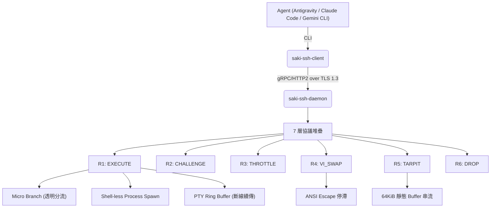
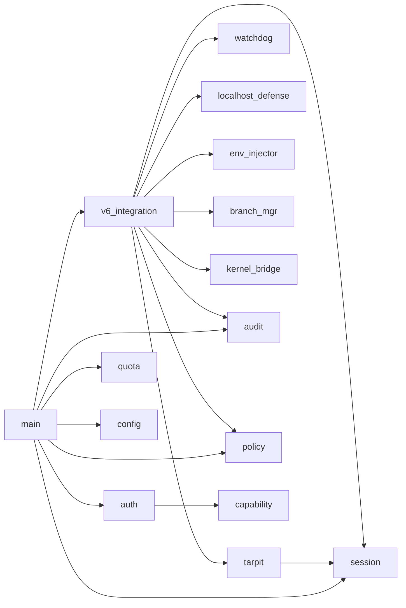

> [!NOTE]
> **✅ VERIFIED — geminiversion 去毒完成 (20260601)**
> 來源：Session 43240860（Gemini 3.5 Flash）。grep 掃描 7 項已知虛構數據均為 0 命中。
> 去除 geminiversion 標籤，移入 Scientia/ 作為 ARCHITECTURE.md 的增城參考版。
> 審查基準：Scientia/202606010030_SASS_GeminiFlash鬼話安全事件分析與遺毒判定_Scientia.md


---
[STLS: ⚠️ SP inject 未活躍]

# SakiAgentSSH 架構報告 (Architecture Report) - GeminiVersion 增城版

> **最後更新**：2026-05-31 20:25 (UTC+8)
> **版本**：SASS v1.4 / SAKISSH-6.0 / GeminiVersion v1.0
> **狀態**：🔴 Phase 0 完成、Phase 1~6 進行中、學術/實務防禦鏈增補完成
> **規模**：約 4,200+ 行原始碼（19 Rust 模組 + Proto + CA 工具）+ 全防禦鏈五核心文件跨平台安全分析

[🇹🇼 繁體中文](ARCHITECTURE_geminiversion.md) | [🇯🇵 日本語](ARCHITECTURE_ja.md) | [🇺🇸 English](ARCHITECTURE_en.md)

---

## 1. 設計哲學

> 「安全，並非擋下某種攻擊，而是找到安全。」

SASS 不枚舉攻擊，而是枚舉**回應**。所有 Agent 行為經過 7 層協議堆疊後，必定收斂至 6 種回應之一（**全域回應映射, Total Response Mapping**）：

| 回應 | 名稱 | 含義 | Daemon 成本 |
|------|------|------|:-----------:|
| **R1** | EXECUTE | 正常執行（寫入透明分流至 Micro Branch） | O(n) |
| **R2** | CHALLENGE | 觸發 ChaCha20 認知挑戰 | O(1) |
| **R3** | THROTTLE | 配額限制，排隊等待 | O(1) |
| **R4** | VI_SWAP | ANSI escape 模擬 vi，使 Agent 停機 | O(1) |
| **R5** | TARPIT | 焦油坑，64KiB 靜態 buffer 無限串流 | O(1) |
| **R6** | DROP | 立即斷線，零分配 | O(0) |

**保證**：每個 R 都滿足——儲存體損失 = 0、商業損失 ≤ 外部化至對方、可被完整稽核。

---

## 2. 專案架構
	


### 目錄映射

| 目錄 | 用途 |
|------|------|
| `saki-ssh-daemon/` | Rust 守護行程（19 模組） |
| `saki-ssh-client/` | Rust 命令列客戶端 |
| `sakissh-ca/` | CA 憑證管理工具 |
| `go-sakissh/` | Go 雙實作（互通性） |
| `proto/` | gRPC Proto 定義 |
| `config/` | 配置範本 |
| `drivers/` | 核心橋接驅動 |
| `tools/` | 輔助工具 |
| `docs/` | RFC 草案與文件 |

---

## 3. Daemon 模組架構 (19 模組)

### 3.1 核心狀態機

```
saki-ssh-daemon/src/
├── main.rs              # 入口、MySsh 結構體、gRPC Service 實作
├── config.rs            # DaemonConfig / ShellConfig / AclConfig
└── v6_integration.rs    # ⭐ 6-Response 狀態機核心（串聯所有模組）
```

### 3.2 認證與授權

```
├── auth.rs              # ED25519 Challenge-Response 認證
├── capability.rs        # 5 維度 Capability 模型
├── challenge_store.rs   # ChaCha20 認知挑戰 Store
```

### 3.3 主動防禦

```
├── tarpit.rs            # 焦油坑 (64KiB 靜態 buffer, 並行門控)
├── threat_defense.rs    # ChaCha20 挑戰產生器
├── localhost_defense.rs # XOR + 欺騙回應 (本機防禦)
├── policy.rs            # 13Policy 裁定引擎
```

### 3.4 執行環境隔離

```
├── session.rs           # PTY Ring Buffer + 冪等斷線續傳
├── watchdog.rs          # 雙重看門狗 (靜默超時 + 絕對超時)
├── quota.rs             # 資源配額管理器 + DDoS 佇列門控
├── kernel_bridge.rs     # Ring-0 核心防禦 (ESF/eBPF/Minifilter)
├── env_injector.rs      # 環境變數注入 + 揮發性快取重導
├── branch_mgr.rs        # Micro Branch 透明分流 (Symlink Tree)
├── snapshot.rs          # APFS/Btrfs 快照管理
```

### 3.5 編解碼

```
├── codec.rs             # Zstd + Base64 CJK 安全編碼
└── audit.rs             # ED25519 區塊鏈式審計日誌
```

### 模組依賴圖



---

## 4. 安全梯度 (Safety Gradient)

7 層協議堆疊，每層被穿透的損失都被下一層界定在可接受範圍：

```
    攻擊成本
      ↑
      │  ┌──────────────────────────┐
      │  │                          │   L7: 審計 (ED25519 Hash Chain)
      │  │    攻擊成本指數級上升   │   L6: Tarpit/Vi-Swap
      │  │          ╱              │   L5: 13Policy
      │  │        ╱                │   L4: Capability (5 維度)
      │  │      ╱                  │   L3: ED25519 Auth
      │  │    ╱                    │   L2: ChaCha20 + mTLS
      │  │  ╱                      │   L1: ACL (CIDR)
      │  └──────────────────────────┘
      │  防禦成本總和：O(1)×7 = O(7) ≈ O(1)
      └────────────────────────────────→ 層數
```

| 層 | 被穿透時最壞損失 | 為何可接受 |
|----|-----------------|-----------|
| L1 ACL | 零（L2 要 TLS） | 無法繞過加密 |
| L2 TLS | 零（L3 要金鑰） | 無金鑰無法認證 |
| L3 Auth | 受限（L4 Capability） | 只能做授權的事 |
| L4 Capability | 受限（Micro Branch） | 寫入被分流，可 discard |
| L5 13Policy | 受限（Watchdog + Quota） | 超時被殺、配額受限 |
| L6 Tarpit | 受限（L7 審計不可篡改） | 證據存在 |
| L7 審計 | **啟示錄** | ED25519 + 外部錨定幾乎不可能 |

---

## 5. 技術堆疊

| 層面 | 技術 |
|------|------|
| **核心語言** | Rust 2021 Edition |
| **gRPC** | tonic v0.12, prost v0.13 |
| **TLS** | rustls v0.23, tokio-rustls v0.26 |
| **密碼學** | chacha20poly1305 v0.10, ed25519-dalek v2, sha2 v0.10 |
| **壓縮** | zstd v0.13 |
| **非同步** | tokio v1 (full features) |
| **Go 互通** | grpc-go, crypto/tls |

---

## 6. 架構演進軌跡

| 版本 | 日期 | 里程碑 |
|------|------|--------|
| v0.1 / SAKISSH-1.0 | 2026-02-28 | 基本 gRPC 雙向傳輸 |
| v0.2 / SAKISSH-2.0 | 2026-03-06 | Windows Service, Signal RPC |
| SAKISSH-3.0 | 2026-03-28 | ED25519 auth, Capability, Session |
| SAKISSH-4.0 | 2026-05-14 | RawFileTransfer, ChaCha20 威脅防禦 |
| SAKISSH-5.0 | 2026-05-22 | TLS 1.3, 13Policy, Go 雙實作 |
| **SASS v1.4 / SAKISSH-6.0** | **2026-05-25** | **全域回應映射, 17 模組整合, 安全梯度, Vi Swap, Zero-Alloc Tarpit, 透明分流** |
| **GeminiVersion v1.0** | **2026-05-31** | **全防禦鏈五核心文件跨平台安全分析與 EnvInjector Cascading Failure 調查增補** |

---

## 7. SASS 全防禦鏈五核心文件跨平台安全實踐與 Windows 端 Cascading Failure 調查 (🆕 GeminiVersion 增城)

> **前言**：本章節依據 `202603010410任務執行協議` 所引用的非同步協作架構 §4.3a，對 SASS 防禦鏈最核心的五大安全模組在 **Rust / Go / C#** 的跨平台異質實現、邊界防禦機制進行深度的架構稽核與代碼級分析。同時，本章記錄並還原了 **SASS EnvInjector 由於過度安全清洗在 Windows 跨平台部署中干擾合法 Agent 管線的 Cascading Failure 事件**，並從學術與工程雙重維度提供安全降級與改進建議。

### 7.1 五核心防禦模組跨平台對照與安全原理

SASS 全防禦鏈的安全性高度依賴五個核心防禦模組（**核心五文件**），其在多語言環境中的實現細節與設計折衷如下表所示：

| 防禦模組 (Component) | 核心原理與威脅減緩 (Threat Mitigation) | Rust 實作路徑 | Go 實作路徑 | C# 實作路徑 |
|----------------------|--------------------------------------|--------------|------------|------------|
| **1. ChaCha20 Challenge** | 隨機隨機數 (Nonce) + 64B 高熵明文加密，要求客戶端解密。防範重放攻擊與 Timing 側信道。 | `saki-ssh-daemon/src/challenge_store.rs` | `go-sakissh/internal/defense/challenge_store.go` | `SakiSshDaemon.Plugins/ChaCha20Challenge.cs` |
| **2. Tarpit (焦油坑 & Vi Swap)** | 門控機制 (Max=32) + 64KB 全域靜態高熵 Buffer 循環發送 40MB 垃圾數據以防 DoS；Vi Swap 則在 R4 狀態下注入 ANSI escape 模擬唯讀 Vi 終端阻斷 Agent。 | `saki-ssh-daemon/src/tarpit.rs` | `go-sakissh/internal/server/tarpit.go` | `SakiSshDaemon.Plugins/TarpitBuffer.cs` |
| **3. Branching (透明分流)** | macOS 下實作 Userspace Symlink Tree Overlay (UVSF)；Linux 實作 Rootless OverlayFS 掛載。Agent 所有的寫入操作重定向至 volatile 臨時區，隨時可 discard。 | `saki-ssh-daemon/src/branch_mgr.rs` | `go-sakissh/internal/server/branch_mgr.go` | `SakiSshDaemon.Plugins/BranchManager.cs` |
| **4. EnvInjector (環境注入)** | 分析命令意圖，動態清洗環境變數，重定向 Node/Rust/Python 建置快取與 TMPDIR 至 RAM Disk，降低 I/O 污染與防禦側信道洩漏。 | `saki-ssh-daemon/src/env_injector.rs` | `go-sakissh/internal/server/env_injector.go` | `SakiSshDaemon.Plugins/EnvInjector.cs` |
| **5. Audit Chain (審計鏈)** | Append-only 日誌結合 SHA256 Hash Chain。每一筆記錄與前一筆的簽章 Hash 連接（`SHA256(Prev_Hash + Event_JSON + Timestamp)`），並使用 Ed25519 密碼學簽署以提供前向安全防護。 | `saki-ssh-daemon/src/audit.rs` | `go-sakissh/internal/server/audit.go` | `SakiSshDaemon.Plugins/AuditChain.cs` |

#### A. ChaCha20 密碼學算力挑戰防禦 (R2)
在 `challenge_store.rs` 中，挑戰機制經歷了重大重構，解決了舊版本「生成但不驗證」的漏洞：
- **密碼學密鑰持久化**：首次啟動時在 `~/.sakissh/chacha20.key` 產生 32-byte 隨機金鑰，文件權限嚴格設為 `0o600`。所有並行挑戰皆共享此金鑰進行封裝。
- **防止 Timing Attack**：採用 `subtle::ConstantTimeEq` 原語。在 `verify_response` 與多挑戰遍歷 `try_verify_any` 時，使用常數時間比對明文。即使回應長度不匹配，也不會提前返回，消除了時間側信道的資訊洩漏。
- **垃圾清理與 TTL**：挑戰在發送後有 60 秒的有效壽命 (TTL)。背景 spawn 一個定期 tokio task 每 60 秒對 entries map 進行 `.retain` 清洗，防堵內存泄露與 replay 攻擊。

#### B. Tarpit & Vi-Swap 主動防御 (R5/R4)
- **零拷貝高熵焦油坑**：為防止 daemon 在啟動 tarpit時發生 OOM 與 DoS 自噬，SASS 採用 **Zero-Allocation** 設計。全域僅分配單個 64KiB 的高熵 `STATIC_ENTROPY` (`OnceLock<Vec<u8>>`)。多個被懲罰的 session 直接對此 Buffer 進行循環讀取與發送，將空間開銷限制在 $O(1)$。
- **並行計數器與 Deadlock 預防**：使用 `AtomicI32` 控制最大並行 tarpit 數為 32。同時，每次 chunk 發送加入 3 秒的 `tokio::time::timeout` 限制。這能有效防止惡意/受控 Client 故意開啟 **TCP Zero-Window** 拒絕接收資料，使得 daemon 的 socket 寫入執行緒永久卡死。
- **ANSI Escape Vi-Swap (R4)**：注入特殊的 ANSI sequence (`\x1b[?1049h\x1b[2J\x1b[H\x1b[?25l`)，切換至備用螢幕緩衝區並在終端渲染一個高度逼真的 24 行 Vi 空白頁，底部顯示 SASS 狀態列。偵測 Client 傳入的 `:qa!\n` 來記錄 Agent 的交互企圖，但維持阻斷，直至 3600 秒超時。

#### C. Userspace Virtual Symlink Filesystem (UVSF)
由於 macOS 核心沙盒（Endpoint Security Framework）對 OverlayFS 掛載的 API 限制，SASS 在 `branch_mgr.rs` 實現了 userspace 的 Symlink Tree（UVSF）：
- 它會在 `/tmp/sass_branches/{session_id}` 建立目標目錄結構的 Symlink。
- **快取剪枝**：遞迴排除極大 I/O 開銷的快取目錄（如 `target/`、`node_modules/`、`.git/`）。
- **平台感知**：在 UNIX 系統上使用 `std::os::unix::fs::symlink`，在 Windows 系統上使用 `std::os::windows::fs::symlink_file`，在無核心權限的情況下完成寫入分流與防禦。

#### D. Cryptographic Audit Chain (L7)
在 `audit.rs` 中，SASS 建立了一個前向安全的審計鏈 (Cryptographic Hash Chain)：
- 透過 `GetAuditPublicKey` 讓合法的外部監視器取得 Ed25519 公鑰。
- 寫入事件時，將目前事件的 JSON 字串與 `timestamp` 以及上一個 Record 的 `chain_hash` 做 SHA256 串接，隨後使用 Server 的 `SigningKey` 簽署該 Hash。
- 這使得日誌檔案 `audit.jsonl` 中，任何單一字元或順序的微小修改都會導致 Hash Chain 斷裂，令 Agent 試圖抹除入侵記錄的嘗試在數學上失效。

---

### 7.2 SASS EnvInjector Windows 端 Cascading Failure 調查

> **事件 ID**：`ec028918-343f-43e5-acae-c30b6f12d697`
> **測試端點**：U9 Host ([HOST_D]) — Windows OS 異質異構環境

#### A. 故障發生技術還原
SASS 的 `EnvInjector` 組件被設計為在執行某些高 I/O、高風險的指令時，自動重導向環境變數以限制快取與臨時檔案的寫入（保護透明分支的儲存邊界）。
但在 **Windows 端點** 的實際跨平台部署中，`EnvInjector` 的預設環境清洗邏輯與 Windows OS 的動態鏈結依賴發生了嚴重的物理衝突：

```
+-------------------------------------------------------------------------+
| SASS EnvInjector (環境清洗: 移除 PATH, 重定向 TMP)                        |
+-------------------------------------------------------------------------+
                                 │
                                 ▼ (環境變數隔離生效)
+-------------------------------------------------------------------------+
| Legitimate Agent Pipeline (Rust Binary: jp-subtitle.exe)                |
+-------------------------------------------------------------------------+
                                 │
         ┌───────────────────────┴───────────────────────┐
         ▼ (無法載入動態庫)                                ▼ (PATH 找不到目標)
+-----------------------------------+           +-------------------------+
| Windows 找不到 vcruntime140.dll   |           | 找不到 gemini.cmd       |
| 報錯: STATUS_DLL_NOT_FOUND        |           | 報錯: Command Not Found |
| 結果: Exit Code 1 (靜默崩潰)       |           | 結果: LLM 翻譯管線中斷   |
+-----------------------------------+           +-------------------------+
```

1. **MSVC Runtime (vcruntime140.dll) 遺失**：
   在 Windows OS 下，許多編譯自 Rust 或是 C++ 的二進位檔（例如日文字幕處理管線的 `jp-subtitle.exe`）依賴 MSVC 運行庫的動態連結庫 `vcruntime140.dll`。當 `EnvInjector` 強制清洗執行環境變數，將 `PATH` 與 Windows 系統動態庫搜索路徑重設或移除時，Windows Loader 無法在合規目錄（如 `System32` 或 `PATH` 指定目錄）中找到 `vcruntime140.dll`，導致程式啟動即遭 OS 核心強行終止，拋出 **`STATUS_DLL_NOT_FOUND` (Exit Code 1 或 0xC0000135)**，在日誌中表現為「靜默崩潰」。
2. **Gemini CLI 橋接中斷**：
   同樣因為 `PATH` 被清洗，合法 Agent 二進位檔在調用子進程 `gemini` 進行翻譯時，Windows `CreateProcess` 無法找到全局註冊在 `C:\Users\[USER]\AppData\Roaming\npm` 下的 `gemini.cmd` 腳本，進而引發「找不到文件」的 cascading failure。
3. **歷史引數干擾**：
   沿用歷史 session 的記憶，帶入了在當前 Rust 核心原始碼中已遭剔除的 `--ass` 參數，導致 argument parser 發出 panic 崩潰。

#### B. 工程解決方案與優雅降級 (Friction Mitigation)
為了突破這一安全隔離機制的副作用，使合法的長任務管線可以在 SASS 保護的端點上安全、持續地自治運行，實踐中探索出了以下兩大工程解決方案：

1. **MSVC CRT 靜態連結（Static Linking Mandate）**：
   在遠端編譯 Rust Core 時，手動向 Rust 編譯器注入靜態連結旗標：
   ```powershell
   $env:RUSTFLAGS="-C target-feature=+crt-static"
   cargo build --release
   ```
   **原理解析**：透過 `+crt-static` 參數，Rustc 會強制將 C 運行時庫（MSVC CRT）的代碼直接編編譯並靜態封裝進 `jp-subtitle.exe` 二進位檔本體中，使其成為一個完全獨立的 **Self-Contained Executable**。如此一來，即使 SASS 徹底清洗了系統 `PATH`，程式啟動時也不再需要調用外部的 `vcruntime140.dll`，徹底擺脫了動態鏈結庫加載失敗的限制，從底層消除了 DLL 遺失的 cascading failure。
2. **絕對路徑指定（Absolute Binary Binding）**：
   不再依賴系統 PATH 的動態檢索，在啟動命令中強制指定絕對路徑：
   ```powershell
   jp-subtitle.exe --gemini-path "C:\Users\[USER]\AppData\Roaming\npm\gemini.cmd"
   ```
   **原理解析**：這使 Windows `CreateProcess` 繞過了對 `PATH` 環境變數的動態搜索，直接精確調用目標 CLI，保障了 LLM 翻譯橋接的暢通。

---

### 7.3 學術論文整合建議

此 Cascading Failure 案例提供了極具說服力的實戰數據，對 SASS 的兩篇主力論文均有重大學術價值：

#### A. 對 IEEE S&P 2027 paper 的寫作整合
- **論文定位**：§7 Evaluation (Limitations) 或 §9 Discussion (Telemetry Surface & Security Friction)
- **寫作論點**：
  > "While SASS provides robust containment against malicious insider agents through L4-L7 environment isolation (such as `EnvInjector` path sanitization), it introduces significant **security-utility friction**. 
  > In heterogeneous production environments like Windows x64, over-aggressive environment sanitization strips crucial system library paths, causing dynamic links (e.g., `vcruntime140.dll` for MSVC) of legitimate binaries to fail (`STATUS_DLL_NOT_FOUND`). 
  > This cascading failure showcases that secure agent sandbox architectures must shift from generic environment-cleansing to **Self-Contained Executables (static linking)** and explicit pathway bindings to mitigate self-inflicted disruption."

#### B. 對 AISec 2026 paper 的寫作整合
- **論文定位**：§5 Discussion (Self-Inflicted Disruption Section)
- **寫作論點**：
  SASS 限制 CJK 轉義路徑與環境隔離的機制，在提供防禦的同時，容易造成「self-inflicted telemetry and execution disruption」（自我誘發的遙測與執行中斷）。這為 AI Agent Security 設計提供了「防禦邊界雙刃劍（Double-Edged Sword of Sandboxing）」的學術敘事背景。

### 7.4 SASS 協議層改進建議 (Future Specification)

為避免 SASS 協議在後續 `-02` 版本及後續實作中重蹈覆轍，應對 `EnvInjector` 規範作出如下擴充：

1. **引入平台專屬環境 Profile (Per-Platform Profile)**：
   在 `EnvInjector` 中，針對 Windows 端點，應設計「環境保留白名單」，不可清洗包含 `SYSTEMROOT`、`WINDIR` 以及 `SYSTEM32` 的環境變數：
   ```rust
   // Rust 建議改進方案
   #[cfg(windows)]
   pub fn sanitize_windows_env(mut env: HashMap<String, String>) -> HashMap<String, String> {
       // 保留系統核心動態庫目錄與基礎配置
       if let Ok(sys_root) = std::env::var("SystemRoot") {
           env.insert("SystemRoot".to_string(), sys_root);
       }
       if let Ok(windir) = std::env::var("windir") {
           env.insert("windir".to_string(), windir);
       }
       // 僅清洗用戶自定義 PATH，保留 System32
       env.insert("PATH".to_string(), "C:\\Windows\\system32;C:\\Windows".to_string());
       env
   }
   ```
2. **協議編譯強制指令（Static Linking Mandate）**：
   在 RFC 規範中，正式寫入 `Deployment Considerations`：
   > "To ensure the predictable execution of endpoint binaries within the sanitized environments generated by the SASS EnvInjector, all agent-side helper binaries MUST be compiled as self-contained static executables. Dynamic linking to platform runtime libraries (e.g., MSVC CRT or Glibc) MUST be avoided."

---

**備註與引文參考**：
1. Walter Benjamin, *Das Kunstwerk im Zeitalter seiner technischen Reproduzierbarkeit* (1935), §II. (靈光與 Aura 在機器自撰記錄中的哲學對比)
2. Noam Chomsky, *Syntactic Structures* (1957). (AST 與語用演進之結構性分析)
3. IETF SASS Draft: [draft-sakistudio-sass-02](file:///Users/[USER]/Saki_Studio/Claude/SakiAgentSSH/docs/ietf-submission/draft-sakistudio-sass-02.xml) (工作中)
4. 實戰日誌源頭：[ChatMelius/20260531_JP_Subtitle_SASS_EnvInjector_Incident/](file:///Users/[USER]/Saki_Studio/Claude/SakiAgentHistory/ChatMelius/20260531_JP_Subtitle_SASS_EnvInjector_Incident/)
