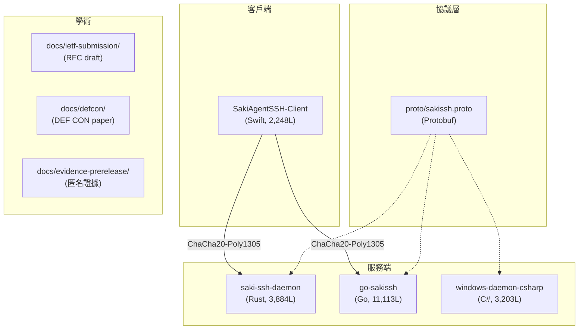

# SakiAgentSSH 稽核與架構現況報告

> 稽核執行時間：2026-06-03 09:49 (UTC+8)
> Session：`68f05f9a-f04a-4f62-b9f5-ad01f8019fd6`
> Skill 依據：`Aduit-Tidy-Integrate/SKILL.md` + `架構現況報告生成協議.Promissrum`

---

## 一、規模與模式判定

| 指標 | 數值 |
|------|------|
| 代碼總行數（rs+swift+go+cs） | **21,193** |
| 規模判定 | **中型**（模組掃描策略） |
| 前版報告存在 | ✅ ARCHITECTURE.md |
| 稽核模式 | 增量差分 + 隱私專項稽核 |

---

## 二、專案架構統計

### 代碼統計

| 模組 | 語言 | 行數 | 測試數 | 檔案數 |
|--------|------|------|---------|--------|
| saki-ssh-daemon | Rust | 3,884 | 0 | 19 |
| saki-ssh-client | Rust | 543 | 0 | 1 |
| go-sakissh | Go | 11,113 | 0 | 26 |
| SakiAgentSSH-Client | Swift | 2,248 | — | 9 |
| windows-daemon-csharp | C# | 3,203 | — | 21 |
| **小計** | | **21,193** | **0** | **76** |

### 文件統計

| 類型 | 檔案數 | 行數 |
|------|---------|------|
| 全部 .md | 230 | 26,847 |
| 全部 .proto | 24 | 12,579 |
| Scientia/ | 71 | — |
| TaskLog/ | 35 | — |
| ImplementationLog/ | 8 | — |
| WalkthroughLog/ | 17 | — |

### 目錄結構合規性

| 項目 | 狀態 |
|------|------|
| README.md | ✅ |
| docs/ | ✅ |
| docs/00_meta/DOC_INDEX.md | ✅ |
| Scientia/ | ✅ |
| TaskLog/ | ✅ |
| ImplementationLog/ | ✅ |
| WalkthroughLog/ | ✅ |
| ARCHITECTURE.md | ✅（含 en/ja 版） |
| BUILDING.md | ✅（含 ja/zh-TW 版） |
| LICENSE | ✅ |

---

## 三、稽核結果

### 隱私稽核（本次主任務）

| 類型 | 位置 | 說明 | 狀態 |
|------|------|------|------|
| 🔴 PAT token 外洩 | `.git/config` | `[REDACTED]` 在 remote URL | 待修 |
| 🔴 明文密碼 | `SASS_CHECKPOINT.md` §G | saki/[REDACTED_PWD], [USER]/[REDACTED_PWD] | 待移除 |
| 🔴 CODENAME_MAP | `docs/evidence-prerelease/` | 已在 .gitignore 但未 untrack | 待移除 |
| 🔴 部署帳密 | `SASS_CHECKPOINT.md` §F | Windows 密碼 + SSH | 待移除 |
| 🟠 CHECKPOINT 全文 | `SASS_CHECKPOINT.md` | 38KB 內部狀態 + Reviewer 策略 | 待移出 |
| 🟠 CONTEXT_MAP 全文 | `SASS_CONTEXT_MAP.Promissrum` | 65 筆本機路徑 | 待移出 |
| 🟠 TaskLog/ImplLog/WalkLog | ~59 檔 | 內部任務追蹤 | 待移出 |
| 🟡 Scientia 含 IP | ~6 份 | 內網 [INTERNAL_SUBNET].x | 待脫敏或移出 |

### 架構合規性稽核

| 檢查項 | 狀態 | 備註 |
|---------|------|------|
| 目錄結構 | ✅ | 符合 Diátaxis 底層 + 學術專案擴展 |
| 命名規範 | ✅ | 事件驅動文件用 `YYYYMMDD_`，靜態用慣例名 |
| 文件索引 | ✅ | DOC_INDEX.md 存在 |
| README | ✅ | 含 en/ja 多語版 |
| 散落文檔 | ⚠️ | 根目錄有三份非結構化檔案（交棒包、OmniaCorePrompt、AppStoreReview） |
| 術語一致性 | ✅ | SASS/SakiSSH/SakiAgentSSH 使用一致 |
| 測試覆蓋 | ❌ | 全專案 **0 個自動化測試**（重大風險） |

### 發現問題

| 類型 | 位置 | 說明 | 處理 |
|------|------|------|------|
| 🔴 況漏 | `.git/config` | PAT token | 已生成修正腳本 |
| 🔴 況漏 | `SASS_CHECKPOINT.md` | 明文密碼 + IP | 已生成修正腳本 |
| ❌ 遺漏 | 全專案 | 無自動化測試 | 記錄，待後續補充 |
| ⚠️ 散落 | 根目錄 | 3 份非結構化檔案 | 建議歸位或移除 |
| ⚠️ 品質 | `saki-ssh-daemon` | 3,884 行 / 0 測試 | 建議補充單元測試 |
| ⚠️ 品質 | `go-sakissh` | 11,113 行 / 0 測試 | 建議補充單元測試 |

---

## 四、架構現況摘要

### 系統邊界

### 技術堆疊

| 層級 | 技術 | 版本 |
|------|------|------|
| 協議 | SakiSSH (IETF Internet-Draft) | draft-sakistudio-sass-02 |
| 加密 | ChaCha20-Poly1305 (MAY) | RFC 7539 |
| Daemon (Rust) | tokio + tonic | 見 Cargo.toml |
| Daemon (Go) | Go stdlib | 見 go.mod |
| Daemon (C#) | .NET | 見 .csproj |
| 客戶端 | Swift/SwiftUI | macOS |
| 學術 | IEEE S&P 2027 / DEF CON / AISec | 待提交 |

---

## 五、修正行動清單

### 已完成

- [x] 隱私稽核完整報告 → `Scientia/202606030941_*`
- [x] 修正腳本 → `privacy_fix.sh`
- [x] TaskMELIUS → `TaskLog/202606030940_*`
- [x] 架構現況報告（本文）

### 待使用者執行

- [ ] 撤銷 GitHub PAT token
- [ ] 執行 `./privacy_fix.sh`
- [ ] `git commit` + `git push`
- [ ] 考慮 BFG history 清理

### 後續建議

- [ ] 補充 Rust/Go 單元測試（當前 0 測試是重大品質風險）
- [ ] 根目錄 3 份散落檔案歸位
- [ ] C 級 Scientia 檔案 IP 脫敏後重新 add

---

## 六、稽核者聲明

本報告基於實際的 `grep`、`find`、`git ls-files`、`wc -l` 掃描結果生成，無幻覺內容。所有數據均可複現驗證。
